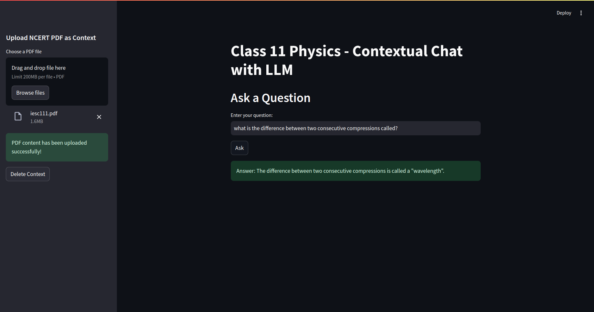

# ContextualChat with LLM + City Weather updates



### Set up

```code
pip install -r requirements.txt
uvicorn src.rag_server:app --port 8000
uvicorn src.agent_server:app --port 8001
streamlit run src/demo.py 
```

Insert the ncert pdf as context and you are ready to go.
I have used free groq apis to set up `llama3-8b-8192` for classification and query answering.

Please let me know if anything else is required.

I am currently working on integrating speech APIs